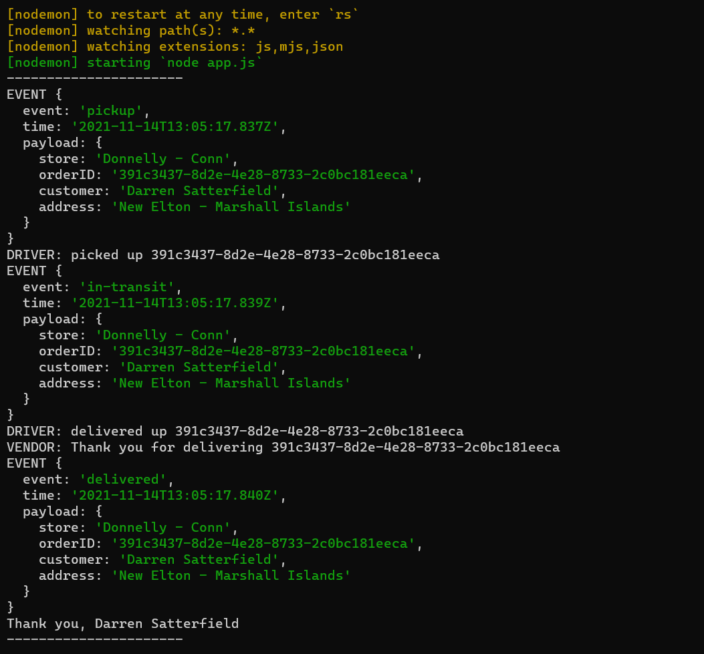
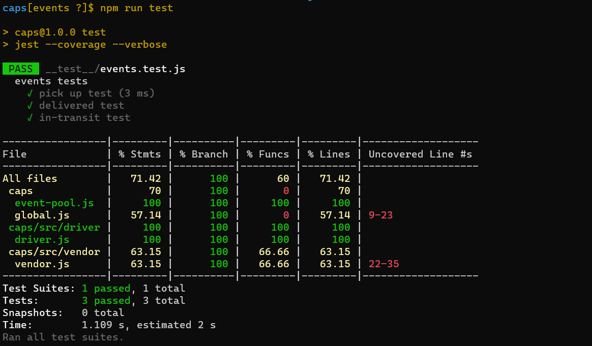
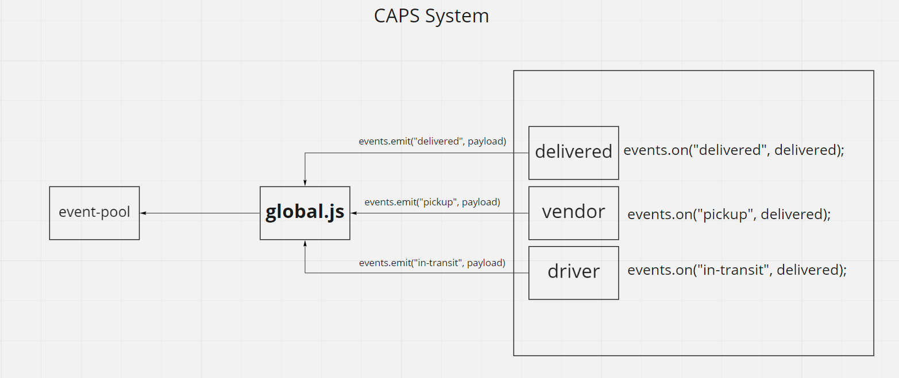

# caps

### Author : Nashat Alzaatreh

## install

1. copy the link of the repo
1. clone the repo on your local machine by `git clone repo-url`
1. download independencies by `npm i`
1. run the app

## Deploy, Run and Test

- [test report](https://github.com/NashatAlzaatreh/caps/actions)

- [Pull Request](https://github.com/NashatAlzaatreh/caps/pull/1)

### Setup

#### Running the app

`npm run dev`

- log:
  - returns
    

#### Test

- Unit test: `npm run test`

- Test returns
  

### UML:

