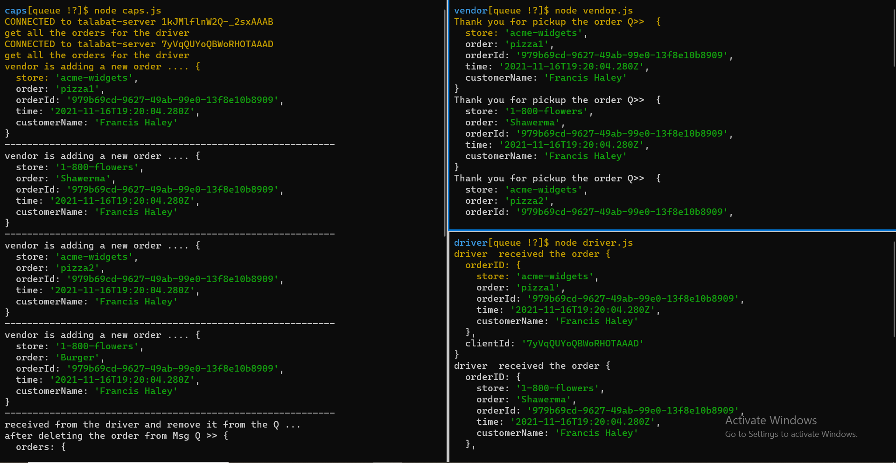
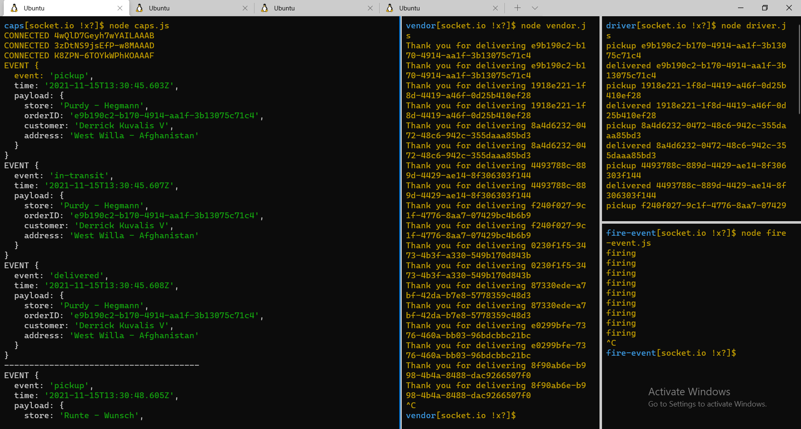
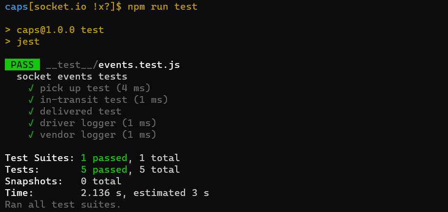
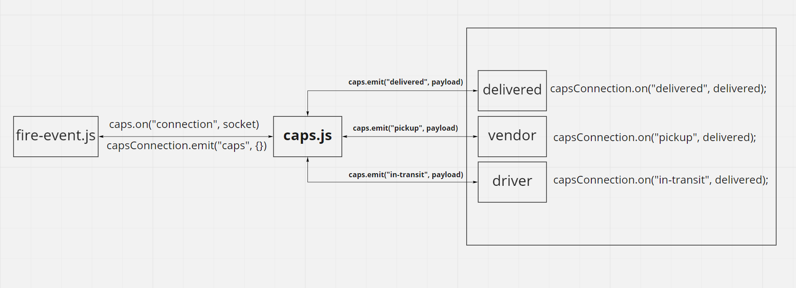

# caps

### Author : Nashat Alzaatreh

## install

1. copy the link of the repo
1. clone the repo on your local machine by `git clone repo-url`
1. download independencies by `npm i`
1. run the app

## Deploy, Run and Test

- ### `Message Queues`:

  - [test report]()
  - [Pull Request]()

- ### `Node events`:

  - [test report](https://github.com/NashatAlzaatreh/caps/actions)
  - [Pull Request](https://github.com/NashatAlzaatreh/caps/pull/1)

- ### `socket.io`:
  - [test report](https://github.com/NashatAlzaatreh/caps/actions)
  - [Pull Request](https://github.com/NashatAlzaatreh/caps/pull/3)

### Setup

- ### `Message Queues`:

  #### Running the app

  `node <fileName>`

  - log:

    

- ### `socket.io`:

  #### Running the app

  `node <fileName>`

  - log:
    - returns
      

  #### Test

  - Unit test: `npm run test`

  - Test returns
    

  ### UML:

  

- ### `Node events`:

  #### Running the app

`npm run dev`

- log:

  - returns
    

  #### Test

  - Unit test: `npm run test`

  - Test returns
    

  ### UML:

  
